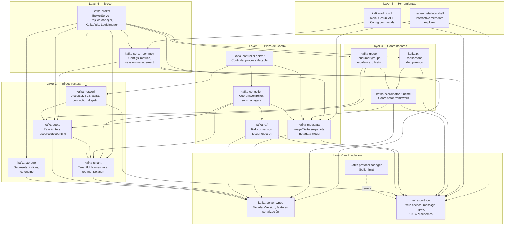

# Kafka Code Inventory & Rust Crate Mapping

> **Programa:** Reescritura Apache Kafka → Rust  
> **Fecha:** 2026-03-15  
> **Rama de referencia:** `apache/kafka@trunk` (≈ Kafka 4.1+)  
> **Prerequisito:** [01_system_vision.md](../vision/01_system_vision.md)

---

## 1. Inventario de Módulos del Repositorio Actual

Fuente: [`settings.gradle`](../../settings.gradle) — 30+ módulos activos (excluyendo tests y upgrade-tests).

### 1.1 Módulos Activos (In-Scope para la Reescritura)

| Módulo Gradle | Lenguaje Predominante | Archivos Clave (src/main) | Plano | Clasificación |
|---|---|---|---|---|
| `clients` | Java | 198 JSON message schemas, `NetworkClient`, `KafkaProducer`, `KafkaConsumer`, `AdminClient` | Wire / Transversal | **Semánticamente crítico** |
| `core` | Scala | `BrokerServer` (923 LOC), `ControllerServer` (507 LOC), `KafkaRaftServer`, `SharedServer`, `KafkaApis`, `ReplicaManager`, `LogManager`, `SocketServer` | Data + Control | **Semánticamente crítico** |
| `raft` | Java | 78 archivos: `KafkaRaftClient`, `LeaderState`, `FollowerState`, `CandidateState`, `QuorumState`, `VoterSet`, `ElectionState`, `RaftLog` | Control | **Semánticamente crítico** |
| `metadata` | Java | 114 archivos: `QuorumController`, `ReplicationControlManager`, `ClusterControlManager`, `ConfigurationControlManager`, `FeatureControlManager`, `AclControlManager`, `ClientQuotaControlManager`, + 30 Image/Delta pairs | Control | **Semánticamente crítico** |
| `storage` | Java | 92 archivos: `LogSegment`, `LocalLog`, `LogManager`, `AbstractIndex`, `OffsetIndex`, `TimeIndex`, `TransactionIndex`, `LogCleaner`, `LeaderEpochFileCache` | Datos | **Semánticamente crítico** |
| `server` | Java | 113 archivos: `BrokerLifecycleManager`, `FetchManager`, `FetchSession`, `ReplicaManager` (parcial), `ClientMetricsManager`, configuraciòn, red, métricas, quotas, replicaciòn | Datos + Transversal | **Semánticamente crítico** |
| `server-common` | Java | 26 archivos: `ApiMessageAndVersion`, `MetadataVersion`, `KRaftVersion`, `TopicIdPartition`, `FeatureVersion`, serialización | Transversal | **Infraestructura crítica** |
| `group-coordinator` | Java | 89 archivos: `GroupCoordinatorService`, `GroupCoordinatorShard`, `GroupMetadataManager`, `OffsetMetadataManager`, assignors (`RangeAssignor`, `UniformAssignor`), consumer groups, share groups | Datos (coordinador) | **Semánticamente crítico** |
| `coordinator-common` | Java | 36 archivos: `CoordinatorRuntime`, `CoordinatorShard`, `CoordinatorLoader`, `PartitionWriter`, `EventAccumulator`, Timer, Metrics | Datos (framework) | **Infraestructura crítica** |
| `transaction-coordinator` | Java/Scala | `TransactionCoordinator`, `TransactionStateManager`, `TransactionMarkerChannelManager` (en `core/`) | Datos (coordinador) | **Semánticamente crítico** |
| `share-coordinator` | Java | `ShareCoordinatorService`, `ShareCoordinatorShard` (análogo a group-coordinator) | Datos (coordinador) | Fase 2 |
| `shell` | Java | 2 archivos: `MetadataShell`, `InteractiveShell` | Herramientas | Compatibilidad |
| `tools` | Java | 40 archivos: `TopicCommand`, `GroupsCommand`, `AclCommand`, `TransactionsCommand`, `DumpLogSegments`, `ConsoleProducer`, etc. | Herramientas | Compatibilidad |
| `generator` | Java | Generador de código para messages desde JSON schemas | Build-time | **Infraestructura crítica** |

### 1.2 Módulos Excluidos (Out of Scope)

| Módulo | Razón de Exclusión |
|---|---|
| `connect:*` (api, runtime, transforms, mirror, etc.) | Ecosistema separado; se integra como cliente externo (N-1 en visión) |
| `streams:*` (core, scala, test-utils, upgrade-tests) | Librería de cliente; no pertenece al broker (N-2 en visión) |
| `trogdor` | Framework de pruebas de fallos; se reemplaza por harness Rust (N-6 en visión) |
| `test-common:*` | Utilidades de test internas; se reimplementan en Rust |
| `jmh-benchmarks` | Benchmarks JVM; se reemplazan por `criterion` en Rust |
| `examples` | Código de ejemplo; se reescribe de cero |

---

## 2. Mapa Módulo → Crate con Dependencias y Multi-Tenencia

### 2.1 Tabla Maestra de Mapeo

| # | Módulo Kafka Java/Scala | Crate Rust | Responsabilidad | Tipo de Código | Impacto Multi-Tenant |
|---|---|---|---|---|---|
| 1 | `clients` (message schemas + codecs) | `kafka-protocol` | Wire protocol: codecs, request/response types, headers, API keys, versiones. Generados desde JSON schemas. | Reescritura + codegen | 🟡 **Consume metadata** — recibe `TenantId` resuelto vía headers; no aplica políticas |
| 2 | `clients` (NetworkClient, Selector) | `kafka-network` | Capa de red: acceptor, conexiones, despacho de requests, TLS, SASL | Reescritura (tokio) | 🔴 **Enforcement** — extrae `TenantId` de conexión, aplica connection quotas, rate limiting por tenant |
| 3 | `storage` + `storage:api` | `kafka-storage` | Log segmentado: segments, índices (offset, time, txn), append, read, retention, compaction | Reescritura | 🔴 **Enforcement** — aplica storage quotas por tenant, retención por tenant, IOPS limiting |
| 4 | `raft` | `kafka-raft` | Motor Raft nativo: elecciones, replicación de log, snapshots, quorum, voter management | Reescritura completa | ⚪ **Agnostic** — no requiere awareness de tenant; opera sobre metadata global |
| 5 | `metadata` (controller/*) | `kafka-controller` | QuorumController: event queue, sub-managers (Replication, Cluster, Config, Feature, ACL, Quota, ProducerId, DelegationToken) | Reescritura con rediseño | 🔴 **Política** — aquí viven las mutaciones de cuotas, topic policies y ACLs por tenant |
| 6 | `metadata` (image/*, fault/*) | `kafka-metadata` | Modelo de metadata inmutable: Image/Delta pairs, snapshots, publicación | Reescritura | 🟡 **Consume metadata** — almacena y sirve quota configs, tenant metadata |
| 7 | `core` (BrokerServer, LogManager, ReplicaManager, KafkaApis) | `kafka-broker` | Orquestación de broker: lifecycle, request handling, replicación, ISR, produce/fetch | Reescritura | 🔴 **Enforcement** — punto central de enforcement de quotas (produce/fetch throttling) |
| 8 | `core` (ControllerServer) | `kafka-controller-server` | Proceso controller: lifecycle, ControllerApis, metadata publishers | Reescritura | 🟡 **Consume metadata** — publica config/quota deltas |
| 9 | `coordinator-common` | `kafka-coordinator-runtime` | Framework genérico de coordinadores: runtime, loader, writer, timer, event accumulator, shard model | Reescritura con rediseño | 🟡 **Consume metadata** — proporciona runtime; la política se aplica en coordinadores específicos |
| 10 | `group-coordinator` | `kafka-group` | Consumer groups: rebalance, offset management, assignors (Range, Uniform), classic + modern groups | Reescritura | 🔴 **Enforcement** — aplica quotas de consumer groups por tenant, namespace-scoping de group names |
| 11 | `transaction-coordinator` (core/) | `kafka-txn` | Transacciones: ProducerId, TransactionalId, AddPartitionsToTxn, EndTxn, abort/commit markers | Reescritura | 🟡 **Consume metadata** — recibe tenant context pero no aplica quotas propias |
| 12 | `server` | `kafka-server-common` | Tipos compartidos: configs, métricas, session management, API versions, lifecycle | Reescritura | 🟡 **Consume metadata** — tipos core compartidos por broker y controller |
| 13 | `server-common` | `kafka-server-types` | Tipos fundamentales: `MetadataVersion`, `KRaftVersion`, `TopicIdPartition`, serialización, features | Reescritura | ⚪ **Agnostic** — tipos de bajo nivel sin awareness de tenant |
| 14 | — (nuevo) | `kafka-tenant` | **Multi-tenencia nativa**: TenantId, NamespaceId, resolución de nombres, routing de topics, aislamiento lógico | Nuevo | 🔴 **Política** — módulo central de tenant management |
| 15 | — (nuevo) | `kafka-quota` | **Motor de cuotas jerárquicas**: enforcement transversal, rate limiters, resource accounting por Cluster→Tenant→Namespace→Topic | Nuevo | 🔴 **Enforcement** — módulo transversal reutilizado por red, storage y coordinadores |
| 16 | `tools` | `kafka-admin-cli` | CLI admin: topic, group, ACL, config, transactions, delegation tokens, dump-log-segments | Reescritura | ⚪ **Agnostic** — herramientas que invocan RPCs administrativos |
| 17 | `shell` | `kafka-metadata-shell` | Shell interactiva para explorar metadata del quorum | Reescritura | ⚪ **Agnostic** — herramienta de inspección |
| 18 | `generator` | `kafka-protocol-codegen` | Generador de código: lee JSON schemas → genera structs Rust + serialización/deserialización | Reescritura completa | ⚪ **Agnostic** — build-time only |

### 2.2 Leyenda de Impacto Multi-Tenant

| Símbolo | Significado |
|---|---|
| 🔴 **Enforcement** | El crate aplica y hace cumplir políticas/cuotas de tenants activamente |
| 🔴 **Política** | El crate define y almacena reglas y configuraciones de tenants |
| 🟡 **Consume metadata** | El crate recibe TenantId/quota resueltos pero no aplica enforcement directo |
| ⚪ **Agnostic** | El crate no tiene awareness de multi-tenencia |

---

## 3. Diagrama de Capas y Dependencias

### 3.1 Grafo de Dependencias entre Crates



### 3.2 Restricciones de Dependencias (Anti-Ciclos)

| Regla | Justificación |
|---|---|
| `kafka-network` **NO** depende de `kafka-storage` | Desacoplar I/O de disco de I/O de red; la integración pasa por traits en `kafka-broker` |
| `kafka-storage` **NO** depende de `kafka-network` | El log engine es puramente local; no conoce el protocolo wire |
| `kafka-raft` **NO** depende de `kafka-storage` | Raft usa su propio `RaftLog` trait; el storage backend se inyecta |
| `kafka-protocol` **NO** depende de ningún otro crate del workspace | Es el crate más bajo; solo depende de `bytes`, `serde`, compresión |
| `kafka-quota` **NO** depende de `kafka-broker` ni coordinadores | Es transversal hacia abajo; los consumidores importan `kafka-quota`, no al revés |
| `kafka-tenant` **NO** depende de `kafka-quota` directamente | Tenant define identidades; Quota define enforcement. Relación vía traits compartidos en `kafka-server-types` |
| Coordinadores (`kafka-group`, `kafka-txn`) **NO** dependen de `kafka-broker` | Usan traits abstractos (`PartitionWriter`, `CoordinatorLoader`) que el broker implementa |

### 3.3 Fronteras de Ownership (Metadata Inmutable)

```
┌─────────────────────────────────────────────────────┐
│  Controller (owner exclusivo de metadata escrita)    │
│                                                     │
│  QuorumController                                   │
│    ├── ReplicationControlManager  ── mutaciones ──►  │
│    ├── ClusterControlManager                        │
│    ├── ConfigurationControlManager                  │
│    ├── ClientQuotaControlManager                    │
│    ├── AclControlManager                            │
│    └── FeatureControlManager                        │
│                        │                            │
│                   Raft Log committed                 │
│                        ▼                            │
│              MetadataImage (snapshot)                │
│                        │                            │
└────────────────────────┼────────────────────────────┘
                         │  Arc<MetadataImage>
                         │  (publicado, inmutable)
                         ▼
┌─────────────────────────────────────────────────────┐
│  Broker / Readers (solo lectura)                     │
│                                                     │
│  ┌──────────────┐  ┌──────────────┐  ┌───────────┐ │
│  │ KRaftMetadata│  │ Quota        │  │ ACL       │ │
│  │ Cache        │  │ Enforcement  │  │ Evaluator │ │
│  └──────────────┘  └──────────────┘  └───────────┘ │
│                                                     │
│  Pattern: ArcSwap<MetadataImage> para hot-swap      │
│  sin locks en el path de lectura.                   │
│                                                     │
└─────────────────────────────────────────────────────┘
```

---

## 4. Archivos Críticos del Kafka Original (Lectura Prioritaria)

### 4.1 Tier 1 — Leer Primero (Definen la Arquitectura)

| # | Archivo | Subsistema | Por Qué Leerlo Primero |
|---|---|---|---|
| 1 | `core/.../BrokerServer.scala` | Broker | Define los ~35 componentes del broker y su orden de inicialización. Es el "main" del data plane. |
| 2 | `core/.../ControllerServer.scala` | Controller | Define el lifecycle del controller, QuorumController builder, metadata publishers. |
| 3 | `core/.../KafkaRaftServer.scala` | Servidor | Patrón SharedServer + roles, startup orchestration. |
| 4 | `metadata/.../QuorumController.java` | Controller | Event queue single-threaded, sub-managers, ControllerResult pattern. Corazón del control plane. |
| 5 | `raft/.../KafkaRaftClient.java` | Raft | Implementación completa del cliente Raft: leader election, log replication, quorum management. |
| 6 | `raft/.../RaftClient.java` | Raft | Interfaz pública del cliente Raft — define el contrato que los consumidores usan. |
| 7 | `storage/.../log/LogSegment.java` | Storage | Unidad fundamental del log: append, read, index maintenance, truncation. |
| 8 | `storage/.../log/LocalLog.java` | Storage | Gestión de múltiples segments, roll, búsqueda por offset/timestamp. |
| 9 | `clients/.../message/README.md` | Protocol | Documentación del sistema de schemas JSON y code generation. |
| 10 | `clients/.../message/*.json` (198 files) | Protocol | Los 198 schemas JSON que definen TODOS los mensajes del wire protocol. |

### 4.2 Tier 2 — Leer para Cada Subsistema

| # | Archivo | Subsistema | Hallazgo Clave |
|---|---|---|---|
| 11 | `metadata/.../ReplicationControlManager.java` | Controller | Leader election, ISR management, partition reassignment — la lógica más compleja del controller. |
| 12 | `metadata/.../ClusterControlManager.java` | Controller | Broker registrations, fencing, controlled shutdown. |
| 13 | `metadata/.../ConfigurationControlManager.java` | Controller | Dynamic configs, topic configs, broker configs. |
| 14 | `metadata/.../ClientQuotaControlManager.java` | Controller/Quota | Gestión de cuotas de clientes — **entry point** para multi-tenant quota policy. |
| 15 | `metadata/.../image/*Image.java` + `*Delta.java` | Metadata | 30+ pares Image/Delta: `TopicsImage`, `AclsImage`, `ClientQuotaImage`, etc. Patrón inmutable. |
| 16 | `server/.../BrokerLifecycleManager.java` | Broker | Estado de vida del broker: registración, heartbeat, fencing, unfencing, controlled shutdown. |
| 17 | `server/.../FetchSession.java` + `FetchManager.java` | Broker | Incremental fetch, session management, cache sharding. |
| 18 | `coordinator-common/.../CoordinatorRuntime.java` | Coordinadores | Framework de runtime para coordinadores: event processing, partition loading/unloading. |
| 19 | `group-coordinator/.../GroupCoordinatorService.java` | Groups | Service wrapper del group coordinator: init, start, partitionFor. |
| 20 | `group-coordinator/.../GroupMetadataManager.java` | Groups | Lógica core de consumer groups: JoinGroup, SyncGroup, Heartbeat, offsets. |
| 21 | `group-coordinator/.../assignor/RangeAssignor.java` | Groups | Implementación de referencia del partition assignment. |
| 22 | `core/.../KafkaApis.scala` | Broker | Dispatch de TODOS los RPCs — mapa completo de ApiKey → handler. |
| 23 | `core/.../ReplicaManager.scala` | Broker | Produce, Fetch, ISR management, leader/follower state, high watermark. |
| 24 | `storage/.../log/LogCleaner.java` | Storage | Compaction: deduplicación de keys, cleaning threads, offset maps. |
| 25 | `storage/.../log/AbstractIndex.java` | Storage | MMap-backed indices: offset index, time index. |

### 4.3 Tier 3 — Herramientas y Utilidades

| # | Archivo | Subsistema | Hallazgo Clave |
|---|---|---|---|
| 26 | `tools/.../TopicCommand.java` | CLI | CRUD de topics vía AdminClient RPCs. |
| 27 | `tools/.../GroupsCommand.java` | CLI | Gestión de consumer groups. |
| 28 | `tools/.../DumpLogSegments.java` | CLI | Inspección de segments on-disk — útil para testing. |
| 29 | `tools/.../AclCommand.java` | CLI | Gestión de ACLs. |
| 30 | `shell/.../MetadataShell.java` | Shell | Shell interactiva para explorar metadata del quorum. |

---

## 5. Clasificación Semántica del Código

### 5.1 Código Semánticamente Crítico (No se puede simplificar)

Código que implementa la **semántica observable** del sistema. Cualquier desviación rompe compatibilidad.

| Área | Qué Incluye | Riesgo si se Simplifica |
|---|---|---|
| **Wire protocol** | 198 message schemas, field ordering, versioning, flexible versions, tagged fields | Clientes existentes no pueden conectarse |
| **RecordBatch format** | Magic byte, CRC, compression, headers, key/value, offsets, timestamps | Los datos producidos no son legibles |
| **Raft consensus** | Leader election, log replication, quorum writes, snapshots, voter changes | Split-brain, pérdida de datos |
| **ISR management** | In-sync replica set, shrink/expand, `replica.lag.time.max.ms` | Pérdida de datos con `acks=all` |
| **Transaction semantics** | ProducerId, epoch, sequence, AddPartitions, TxnOffsetCommit, EndTxn, abort markers | Exactly-once roto |
| **Consumer group protocol** | JoinGroup, SyncGroup, Heartbeat, LeaveGroup, rebalance triggers | Consumers existentes no funcionan |
| **Offset management** | Per-partition monotonic offsets, `__consumer_offsets` topic, offset commit/fetch | Offsets perdidos, double-processing |
| **ACL evaluation** | ResourceType, PatternType, Operation, PermissionType evaluation order | Brechas de seguridad |

### 5.2 Infraestructura Crítica (Reimplementar con Equivalente Rust)

Código que proporciona **soporte fundamental** pero no define semántica observable directamente.

| Área | Qué Incluye | Estrategia Rust |
|---|---|---|
| **Message codegen** | `generator/` — lee JSON schemas, genera Java | Reemplazar con generador Rust (procedural macro o build script) |
| **Coordinator runtime** | `coordinator-common/` — event loop, partition loading, shard model | Reimplementar con Tokio tasks, sin cambio semántico |
| **Config system** | `server/config/` — Dynamic configs, broker configs, topic configs | Reimplementar con `serde` + hot-reload vía `arc-swap` |
| **Metrics framework** | `server/metrics/` — Yammer metrics, JMX | Reimplementar con `metrics` crate o `prometheus` |
| **Scheduler** | `KafkaScheduler` — background tasks | Reemplazar con `tokio::time` + semáforos |
| **Timer wheel** | `SystemTimer`, `TimingWheelExpirationService` | Reimplementar o usar `tokio-util::time::DelayQueue` |
| **Purgatory** (delayed operations) | `DelayedProduce`, `DelayedFetch`, `DelayedJoin` | Reimplementar con futures + timer wheel Rust-native |

### 5.3 Compatibilidad Histórica (Puede Eliminarse o Simplificarse)

| Área | Qué Incluye | Decisión |
|---|---|---|
| **ZooKeeper support** | Todo código de ZK en `core/` | ❌ Eliminar — solo KRaft |
| **Legacy consumer group protocol** | Old consumer rebalance (pre-KIP-848) | ⚠️ Mantener classic protocol por compatibilidad, pero diseñar para deprecación |
| **Managed consumer rebalance assignors** | `StickyAssignor`, `RoundRobinAssignor` (client-side) | ❌ No aplica al broker — son client-side |
| **Connect / Streams hooks** | Código en `core/` para Connect/Streams | ❌ Eliminar — out of scope |
| **Trogdor** | Testing framework | ❌ Reemplazar con harness Rust |
| **JMX metrics** | Java Management Extensions | ❌ Reemplazar con métricas Rust-native |
| **JVM specifics** | GC tuning, JVM flags, classloading | ❌ No aplica |

---

## 6. Dependencias Internas Detalladas

### 6.1 Tabla de Dependencias (→ = "depende de")

| Crate | Depende de |
|---|---|
| `kafka-protocol` | (ninguno del workspace; solo `bytes`, `serde`, compresión) |
| `kafka-server-types` | (ninguno del workspace; tipos fundamentales) |
| `kafka-protocol-codegen` | (build-time; lee JSON schemas) |
| `kafka-network` | `kafka-protocol`, `kafka-quota`, `kafka-tenant`, `kafka-server-types` |
| `kafka-storage` | `kafka-server-types`, `kafka-protocol` (para RecordBatch) |
| `kafka-quota` | `kafka-server-types`, `kafka-tenant` |
| `kafka-tenant` | `kafka-server-types` |
| `kafka-raft` | `kafka-protocol`, `kafka-server-types` |
| `kafka-metadata` | `kafka-server-types`, `kafka-protocol` |
| `kafka-controller` | `kafka-metadata`, `kafka-raft`, `kafka-quota`, `kafka-tenant` |
| `kafka-controller-server` | `kafka-controller`, `kafka-network`, `kafka-metadata` |
| `kafka-coordinator-runtime` | `kafka-protocol`, `kafka-server-types`, `kafka-metadata` |
| `kafka-group` | `kafka-coordinator-runtime`, `kafka-quota`, `kafka-tenant` |
| `kafka-txn` | `kafka-coordinator-runtime`, `kafka-protocol` |
| `kafka-server-common` | `kafka-server-types`, `kafka-protocol`, `kafka-quota` |
| `kafka-broker` | `kafka-network`, `kafka-storage`, `kafka-metadata`, `kafka-group`, `kafka-txn`, `kafka-quota`, `kafka-tenant`, `kafka-server-common` |
| `kafka-admin-cli` | `kafka-protocol`, `kafka-server-common` |
| `kafka-metadata-shell` | `kafka-metadata`, `kafka-protocol` |

### 6.2 Verificación de Aciclicidad

El grafo anterior es un DAG válido. La verificación se puede automatizar:

```bash
# En el Cargo.toml workspace, usar cargo-deny para detectar ciclos
cargo deny check bans
```

---

## 7. Workspace Rust Propuesto

### 7.1 Estructura de Directorios

```
kafka-rust/
├── Cargo.toml                     # [workspace] con resolver = "2"
├── Cargo.lock
├── deny.toml                      # cargo-deny config
├── rust-toolchain.toml            # Rust version pinning
│
├── crates/
│   ├── kafka-protocol/            # Layer 0 — Wire protocol
│   │   ├── Cargo.toml
│   │   ├── build.rs              # Invoca kafka-protocol-codegen
│   │   └── src/
│   │
│   ├── kafka-server-types/        # Layer 0 — Tipos fundamentales
│   ├── kafka-protocol-codegen/    # Layer 0 — Build-time codegen
│   │
│   ├── kafka-network/             # Layer 1 — Red
│   ├── kafka-storage/             # Layer 1 — Log engine
│   ├── kafka-quota/               # Layer 1 — Quota engine
│   ├── kafka-tenant/              # Layer 1 — Tenant management
│   │
│   ├── kafka-raft/                # Layer 2 — Raft consensus
│   ├── kafka-metadata/            # Layer 2 — Metadata model
│   ├── kafka-controller/          # Layer 2 — QuorumController
│   ├── kafka-controller-server/   # Layer 2 — Controller process
│   │
│   ├── kafka-coordinator-runtime/ # Layer 3 — Coordinator framework
│   ├── kafka-group/               # Layer 3 — Consumer groups
│   ├── kafka-txn/                 # Layer 3 — Transactions
│   │
│   ├── kafka-server-common/       # Layer 4 — Shared server types
│   ├── kafka-broker/              # Layer 4 — Broker process
│   │
│   ├── kafka-admin-cli/           # Layer 5 — CLI tools
│   └── kafka-metadata-shell/      # Layer 5 — Metadata shell
│
├── schemas/                       # Los 198 JSON message schemas (copiados de Kafka)
│   └── *.json
│
├── docs/
│   ├── adr/                       # Architecture Decision Records
│   ├── vision/                    # System vision
│   └── inventory/                 # Este documento
│
└── tests/
    ├── integration/               # Tests de integración cross-crate
    └── differential/              # Tests diferenciales contra Kafka Java
```

### 7.2 Cargo.toml Raíz

```toml
[workspace]
resolver = "2"
members = [
    "crates/kafka-protocol",
    "crates/kafka-protocol-codegen",
    "crates/kafka-server-types",
    "crates/kafka-network",
    "crates/kafka-storage",
    "crates/kafka-quota",
    "crates/kafka-tenant",
    "crates/kafka-raft",
    "crates/kafka-metadata",
    "crates/kafka-controller",
    "crates/kafka-controller-server",
    "crates/kafka-coordinator-runtime",
    "crates/kafka-group",
    "crates/kafka-txn",
    "crates/kafka-server-common",
    "crates/kafka-broker",
    "crates/kafka-admin-cli",
    "crates/kafka-metadata-shell",
]

[workspace.dependencies]
tokio = { version = "1.38", features = ["full"] }
tracing = "0.1"
tracing-subscriber = { version = "0.3", features = ["env-filter"] }
thiserror = "2.0"
serde = { version = "1.0", features = ["derive"] }
serde_json = "1.0"
bytes = "1.0"
arc-swap = "1.7"
dashmap = "6.0"
parking_lot = "0.12"
crc32c = "0.6"
lz4_flex = "0.11"
snap = "1.1"
zstd = "0.13"
tokio-rustls = "0.26"
criterion = "0.5"
```

### 7.3 Herramientas de Gobernanza

| Herramienta | Propósito | Configuración |
|---|---|---|
| `cargo-deny` | Auditoría de licencias, bans, advisories, duplicados | `deny.toml` |
| `cargo-audit` | CVE scanning | CI pipeline |
| `cargo-nextest` | Test runner paralelo | `.config/nextest.toml` |
| `cargo-llvm-cov` | Coverage de código | CI pipeline |
| `cargo fmt` | Formateo uniforme | `rustfmt.toml` |
| `cargo clippy` | Linting | `--deny warnings` en CI |

---

## 8. Riesgos de Acoplamiento y Plan de Mitigación

### 8.1 Riesgos Identificados

| ID | Riesgo | Probabilidad | Impacto | Mitigación |
|---|---|---|---|---|
| R-1 | Copiar la estructura de `core/` que mezcla Scala traits, implicits y mutable state, heredando acoplamiento innecesario | Alta | Alto | Separar en crates con fronteras claras desde el inicio. No mapear 1:1 paquetes Java → módulos Rust. |
| R-2 | `QuorumController` es monolítico (~4000 LOC) con sub-managers acoplados | Media | Alto | Extraer cada sub-manager como módulo interno con trait boundaries. El event queue orquesta pero no contiene lógica de negocio. |
| R-3 | `KafkaApis` es un mega-dispatcher (~90 handlers) con dependencias a todo el broker | Alta | Alto | Descomponer en traits por dominio (`ProduceHandler`, `FetchHandler`, `GroupHandler`, etc.). Cada trait vive en su crate. |
| R-4 | Log storage y protocol están acoplados vía `RecordBatch` | Media | Medio | `RecordBatch` vive en `kafka-protocol`. Storage importa y usa; no redefine. |
| R-5 | No reservar módulo transversal para quotas, obligando a retrofits | Alta | Alto | `kafka-quota` definido desde el inicio como crate transversal. API de traits que cada consumidor implementa. |
| R-6 | `MetadataImage` tiene ~15 sub-images con deltas acoplados | Media | Medio | Cada par Image/Delta es inmutable. Publicación vía `ArcSwap`. Hot-swap atómico sin locks. |
| R-7 | Unificar demasiado pronto crates con ritmos de cambio distintos (ej: protocol + raft) | Media | Medio | Mantener crates separados. El protocol se estabiliza rápido; raft evoluciona más lento. |
| R-8 | El coordinator-common runtime tiene acoplamiento con el partition log model de Kafka | Media | Medio | Abstraer `PartitionWriter` y `CoordinatorLoader` como traits en `kafka-coordinator-runtime`, implementados por `kafka-broker`. |

### 8.2 Fronteras Contractuales (Traits como Firewalls)

```rust
// En kafka-coordinator-runtime
pub trait PartitionWriter: Send + Sync {
    fn append(&self, tp: TopicPartition, records: Vec<CoordinatorRecord>) -> Result<u64>;
}

pub trait CoordinatorLoader: Send + Sync {
    fn load(&self, tp: TopicPartition) -> Result<LoadedState>;
}

// En kafka-storage (no conoce coordinadores)
pub trait LogAppender: Send + Sync {
    fn append(&self, records: &RecordBatch) -> Result<LogAppendInfo>;
}

// En kafka-quota (transversal)
pub trait QuotaEnforcer: Send + Sync {
    fn check_and_maybe_throttle(&self, tenant: &TenantId, resource: QuotaResource, amount: u64) -> ThrottleResult;
    fn record_usage(&self, tenant: &TenantId, resource: QuotaResource, amount: u64);
}

// En kafka-tenant (identidad)
pub trait TenantResolver: Send + Sync {
    fn resolve(&self, connection: &ConnectionContext) -> Result<TenantId>;
    fn map_topic_name(&self, tenant: &TenantId, namespace: &NamespaceId, topic: &str) -> InternalTopicName;
}
```

---

## 9. Orden de Reescritura por Capas (Priorizado por Riesgo)

### Fase 0 — Cimientos (Semanas 1–4)

| Orden | Crate | Justificación |
|---|---|---|
| 0.1 | `kafka-server-types` | Tipos fundamentales que todos usan. Sin esto, nada compila. |
| 0.2 | `kafka-protocol-codegen` | Construir el generador de código para los 198 message schemas. |
| 0.3 | `kafka-protocol` | Wire protocol completo. Es el contrato público #1. Sin esto, no hay comunicación. |

> **Criterio de salida:** Un struct Rust por cada mensaje Kafka se serializa/deserializa idénticamente al formato binario original. Tests diferenciales contra librdkafka.

### Fase 1 — Almacenamiento + Raft (Semanas 5–12)

| Orden | Crate | Justificación |
|---|---|---|
| 1.1 | `kafka-storage` | El log segmentado es el alma del sistema. Más riesgo técnico aquí que en ningún otro sitio. |
| 1.2 | `kafka-raft` | Motor de consenso. Sin Raft, no hay controller. Puede desarrollarse en paralelo con storage. |
| 1.3 | `kafka-tenant` | Definir identidades y routing desde el inicio para no retrofitear. |
| 1.4 | `kafka-quota` | Motor de cuotas. Definir API de traits temprano para que storage y network lo consuman. |

> **Criterio de salida:** Log engine pasa tests de append/read/truncation/compaction. Raft consensus pasa tests de Jepsen-lite (leader election, log replication, network partitions).

### Fase 2 — Plano de Control (Semanas 13–20)

| Orden | Crate | Justificación |
|---|---|---|
| 2.1 | `kafka-metadata` | Modelo de metadata inmutable: Image/Delta. Foundation para el controller. |
| 2.2 | `kafka-controller` | QuorumController con sub-managers. Requiere metadata + raft. |
| 2.3 | `kafka-controller-server` | Proceso controller con network y lifecycle. |

> **Criterio de salida:** Un controller cluster de 3 nodos puede elegir líder, manejar registros de brokers, y servir metadata vía Raft.

### Fase 3 — Data Plane (Semanas 21–30)

| Orden | Crate | Justificación |
|---|---|---|
| 3.1 | `kafka-network` | Capa de red con TLS, SASL, connection management, quotas. |
| 3.2 | `kafka-server-common` | Configs, metrics, sessions. |
| 3.3 | `kafka-coordinator-runtime` | Framework de coordinadores. |
| 3.4 | `kafka-group` | Consumer groups con rebalance. |
| 3.5 | `kafka-txn` | Transacciones. |
| 3.6 | `kafka-broker` | Integración de todo: KafkaApis, ReplicaManager, LogManager, lifecycle. |

> **Criterio de salida:** Un cliente Kafka estándar puede producir y consumir mensajes con un cluster de 3 brokers + 3 controllers. Consumer groups funcionan con rebalance.

### Fase 4 — Herramientas y Polish (Semanas 31–36)

| Orden | Crate | Justificación |
|---|---|---|
| 4.1 | `kafka-admin-cli` | CLI para operaciones administrativas. |
| 4.2 | `kafka-metadata-shell` | Shell interactiva. |
| 4.3 | Tests diferenciales completos | Contra Kafka Java para los 20+ escenarios de protocolo más frecuentes. |
| 4.4 | Benchmarks | `criterion` benchmarks para cumplir SLOs. |

> **Criterio de salida:** Todos los criterios de aceptación del documento de visión (sección 12) se cumplen.

---

## 10. Resumen Ejecutivo

### Por los Números

| Métrica | Valor |
|---|---|
| Módulos Kafka Java/Scala in-scope | 14 |
| Módulos excluidos (Connect, Streams, etc.) | 8+ |
| Crates Rust propuestos | 18 |
| Crates nuevos (sin equivalente Java) | 2 (`kafka-tenant`, `kafka-quota`) |
| Archivos de message schemas | 198 |
| Archivos Java/Scala críticos (Tiers 1+2) | 25 |
| Restricciones de dependencia (anti-ciclos) | 7 |
| Riesgos de acoplamiento identificados | 8 |
| Fases de reescritura | 5 (0–4) |

### Decisiones Clave

1. **18 crates**, no 14 — se añaden `kafka-tenant` y `kafka-quota` como módulos transversales desde el inicio.
2. **Code generation propio** — no se usa `prost-build` (que es para Protobuf); Kafka tiene su propio formato de schemas JSON. Se necesita un generador Rust específico.
3. **Traits como firewalls** — cada crate expone traits de abstracciones en lugar de tipos concretos, rompiendo ciclos de dependencia.
4. **Metadata inmutable** — el patrón Image/Delta con `ArcSwap` permite lecturas sin lock en el hot path.
5. **Fase 0 = Protocol** — si el wire protocol no es idéntico, nada funciona. Es la primera prioridad.

---

*Documento generado como parte del programa de reescritura Kafka → Rust.*  
*Prerequisito: [01_system_vision.md](../vision/01_system_vision.md)*  
*Siguiente prompt: `03_wire_protocol_y_codegen.md`*
