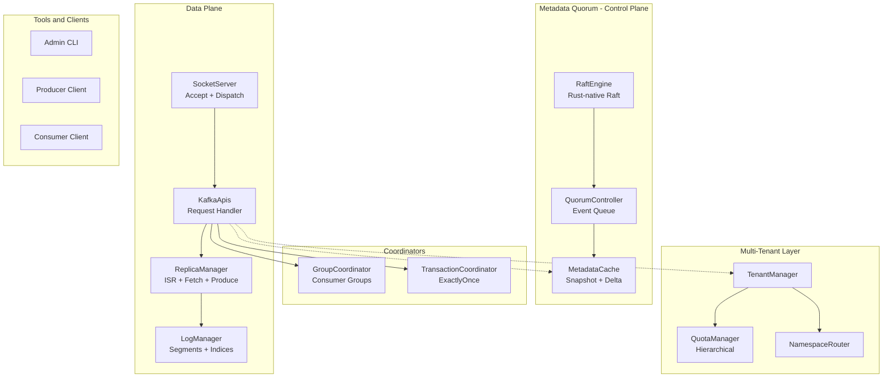

# Kafka-Rust: System Vision & Non-Negotiable Requirements

> **Programa:** Reescritura completa de Apache Kafka en Rust
> **Fecha de referencia:** 2026-03-15
> **Rama de referencia:** `apache/kafka@trunk` (≈ Kafka 4.1+)
> **Estado:** Borrador fundacional — v0.1

---

## 1. Declaración de Misión

Construir un sistema de streaming distribuido en Rust que sea **wire-compatible** con el ecosistema Apache Kafka, eliminando la dependencia de ZooKeeper mediante una implementación nativa de Raft (KRaft-Rust). El sistema será **cloud-ready** y **multi-tenant de nacimiento**, con aislamiento jerárquico de recursos, observabilidad por tenant y despliegue nativo en Kubernetes.

### 1.1 Principio Rector

> *Todo lo que se puede medir, se puede limitar. Todo lo que se puede limitar, se puede aislar. Todo lo que se puede aislar, se puede cobrar.*

---

## 2. Objetivos y No-Objetivos

| # | Objetivos (IN SCOPE) | Prioridad |
|---|---|---|
| O-1 | Compatibilidad wire con clientes Kafka (protocolo binario, versiones de API Produce/Fetch/Metadata/FindCoordinator, etc.) | **P0** |
| O-2 | Log segmentado propio con semántica idéntica: segments, índices, offsets, LEO, HW, leader epoch | **P0** |
| O-3 | Implementación nativa de Raft en Rust para el metadata quorum (equivalente funcional a KRaft) | **P0** |
| O-4 | Roles separados: BrokerServer y ControllerServer, con modo combinado solo para dev/tests | **P0** |
| O-5 | Multi-tenencia nativa: TenantId, NamespaceId, cuotas jerárquicas, retención independiente | **P0** |
| O-6 | Semántica completa de ISR, acks={0,1,all}, idempotencia, transacciones exactly-once | **P0** |
| O-7 | Consumer groups con protocolo de rebalance (Eager, Cooperative, Server-side Assignment) | **P1** |
| O-8 | ACLs compatibles y extensibles con filtros por tenant | **P1** |
| O-9 | Herramientas admin (kafka-topics, kafka-configs, kafka-consumer-groups equivalentes) | **P1** |
| O-10 | Observabilidad estructurada por tenant (métricas, logs, traces) | **P1** |
| O-11 | Despliegue cloud-native: StatefulSet-friendly, readiness/liveness probes, graceful shutdown | **P1** |
| O-12 | Aislamiento de recursos: CPU, memoria, IOPS, almacenamiento con presupuestos por tenant | **P1** |

| # | No-Objetivos (OUT OF SCOPE) | Razón |
|---|---|---|
| N-1 | Kafka Connect | Ecosistema separado; se integra como cliente externo |
| N-2 | Kafka Streams / ksqlDB | Librerías de cliente; no pertenecen al broker |
| N-3 | Soporte de ZooKeeper | Explícitamente eliminado; solo KRaft-Rust |
| N-4 | Compatibilidad binaria JVM (plugins .jar) | Reescritura en Rust; se proveerá API de extensiones nativa |
| N-5 | Mirror Maker como módulo interno | Se integra como herramienta externa contra la API wire |
| N-6 | Trogdor (framework de pruebas de fallos) | Se reemplaza por harness de pruebas Rust + chaos engineering externo |
| N-7 | Share Groups (KIP-932) | Fase 2 — después de estabilizar el core |

---

## 3. Matriz de Compatibilidad

| Dimensión | Nivel | Detalle |
|---|---|---|
| **Protocolo wire** | 🟢 Idéntico | Requests/Responses binarios. Se generan desde los JSON schemas de `clients/src/main/resources/common/message/*.json`. Mismos ApiKeys, versiones y header formats. |
| **Formato de registro (RecordBatch)** | 🟢 Idéntico | Magic byte = 2. CRC, compression (none, gzip, snappy, lz4, zstd), headers, timestamps, keys, values. |
| **Semántica de `acks`** | 🟢 Idéntico | `acks=0`: fire-and-forget. `acks=1`: líder persiste. `acks=all`: todas las réplicas ISR confirman. |
| **ISR** | 🟢 Idéntico | Definición, shrink, expand y propagación vía metadata. `replica.lag.time.max.ms` respetado. |
| **Leader Epoch** | 🟢 Idéntico | Fencing, truncación, LeaderAndIsrRequest equivalente vía metadata records. |
| **HW / LEO** | 🟢 Idéntico | High watermark avanza con ISR. LEO es local por réplica. |
| **Idempotencia** | 🟢 Idéntico | ProducerId + ProducerEpoch + Sequence numbers. Deduplicación exacta. |
| **Transacciones** | 🟢 Idéntico | TransactionalId, InitProducerId, AddPartitionsToTxn, TxnOffsetCommit, EndTxn. Read committed/uncommitted. |
| **Offsets** | 🟢 Idéntico | Per-partition, monotónico. OffsetCommit/OffsetFetch. `__consumer_offsets` topic interno. |
| **ACLs** | 🟡 Compatible | Mismos recursos (Topic, Group, Cluster, TransactionalId, DelegationToken) + extensión `Tenant` y `Namespace` como recursos adicionales sin romper el wire. |
| **Consumer Groups** | 🟢 Idéntico | JoinGroup, SyncGroup, Heartbeat, LeaveGroup. Assignors configurables. |
| **Herramientas admin** | 🟡 Compatible | CLI propia en Rust que emite las mismas AdminClient RPCs. Output puede diferir cosméticamente. |
| **Formato en disco** | 🔴 Rediseñable | No se garantiza compatibilidad binaria de archivos de log on-disk. Se migran datos vía replicación. |
| **Configuraciones internas** | 🟡 Compatible | Se respetan los nombres de configuración estándar donde aplique. Nuevas configs para tenancy/Rust. |
| **Plugins JVM** | 🔴 No compatible | No hay JVM. Se ofrecerá API de extensión nativa (trait-based). |

**Leyenda:** 🟢 = Idéntico al protocolo/semántica de Kafka. 🟡 = Compatible con extensiones documentadas. 🔴 = Rediseño explícito; migración asistida.

---

## 4. SLOs Iniciales

| Métrica | Target | Contexto |
|---|---|---|
| **Disponibilidad (cluster)** | ≥ 99.95% | Medida como capacidad de servir Produce + Fetch sin error en un clúster ≥ 3 nodos. |
| **Latencia Produce p50** | ≤ 2 ms | `acks=1`, sin compresión, batch de 1 mensaje, red local. |
| **Latencia Produce p99** | ≤ 10 ms | `acks=1`, mismas condiciones. |
| **Latencia Produce p99 (acks=all)** | ≤ 25 ms | RF=3, ISR=3, red local. |
| **Latencia Fetch p50** | ≤ 3 ms | Consumidor siguiendo el HW (caught-up). |
| **Latencia Fetch p99** | ≤ 15 ms | Consumidor siguiendo HW. |
| **Durabilidad** | ≤ 10⁻⁹ pérdida de registro | Con `acks=all`, RF=3, ISR ≥ 2. Un registro confirmado no se pierde. |
| **Tiempo de recuperación (broker)** | ≤ 30 s | Desde crash hasta capacidad de servir particiones (con log segments intactos). |
| **Tiempo de elección de líder** | ≤ 5 s | Failover de una partición cuando el líder cae. |
| **Aislamiento entre tenants** | ≤ 5% desviación | Un tenant bajo carga total no degrada a otros más de un 5% vs su baseline aislado. |
| **Throughput mínimo por broker** | ≥ 800 MB/s | Produce sustained, con batching, sin compresión. Hardware de referencia: NVMe, 10 GbE. |

---

## 5. Decisión de Roles: Broker y Controller

### Decisión

La **primera entrega** soportará **roles separados** (`process.roles=broker` y `process.roles=controller`), siguiendo exactamente el patrón de `KafkaRaftServer.scala`:

```
KafkaRaftServer
├── SharedServer (RaftManager, metrics, metaPropsEnsemble)
├── BrokerServer  (data plane: ReplicaManager, LogManager, coordinators, quotas)
└── ControllerServer (control plane: QuorumController, metadata publishers)
```

### Modo Combinado

El modo combinado (`process.roles=broker,controller`) estará **disponible pero restringido**:

- ✅ Desarrollo local, CI, tests de integración, clústeres ≤ 3 nodos.
- ⛔ **No recomendado** para producción multi-tenant ni clústeres ≥ 5 nodos.
- El modo combinado compartirá un único proceso Tokio con runtimes separados para control plane y data plane.

### Justificación

El código fuente de Kafka demuestra que el modelo de roles separados es la arquitectura target:
- `BrokerServer` tiene ~30 componentes independientes (LogManager, ReplicaManager, GroupCoordinator, TransactionCoordinator, ShareCoordinator, etc.)
- `ControllerServer` opera un `QuorumController` single-threaded basado en event queue
- La separación permite escalar controllers y brokers independientemente, crítico para multi-tenencia

---

## 6. Principios de Diseño Rust

### 6.1 Seguridad y Ownership

| Principio | Regla |
|---|---|
| **Mínimo `unsafe`** | Todo bloque `unsafe` requiere comentario `// SAFETY:` y review explícito. Meta: <0.1% de líneas. |
| **Ownership claro** | Cada estructura de datos tiene un dueño definido. No `Arc<Mutex<T>>` casual; usar canales o ownership transfer. |
| **Sin data races** | El type system de Rust es la primera línea. `Send + Sync` se derivan, no se fuerzan con `unsafe impl`. |
| **Errores explícitos** | `Result<T, E>` siempre. No `unwrap()` en código de producción. `thiserror` para errores tipados. |

### 6.2 Separación de Planos

```
┌─────────────────────────────────────────────────────────────┐
│  Control Plane (Tokio runtime dedicado)                     │
│  ┌─────────────┐  ┌──────────────────┐  ┌───────────────┐  │
│  │ RaftEngine   │  │ QuorumController │  │ MetadataCache │  │
│  └─────────────┘  └──────────────────┘  └───────────────┘  │
├─────────────────────────────────────────────────────────────┤
│  Data Plane (Tokio runtime dedicado)                        │
│  ┌────────────┐  ┌───────────────┐  ┌──────────────────┐   │
│  │ SocketServer│  │ ReplicaManager│  │ LogManager      │   │
│  │ (accept +   │  │ (ISR, fetch,  │  │ (segments,      │   │
│  │  dispatch)  │  │  produce)     │  │  índices, flush) │   │
│  └────────────┘  └───────────────┘  └──────────────────┘   │
├─────────────────────────────────────────────────────────────┤
│  Maintenance (spawn_blocking acotado por semáforos)          │
│  ┌────────────┐  ┌───────────────┐  ┌──────────────────┐   │
│  │ Compaction  │  │ Log Retention │  │ Segment Roll     │   │
│  └────────────┘  └───────────────┘  └──────────────────┘   │
└─────────────────────────────────────────────────────────────┘
```

- **Control plane:** Single-threaded event loop (como `QuorumController.java`). Todas las mutaciones de metadata pasan por la event queue.
- **Data plane:** Multi-threaded, I/O bound. Tokio con work-stealing.
- **Maintenance:** Tareas CPU/IO-bound (compaction, retention cleanup) ejecutadas con `tokio::task::spawn_blocking`, limitadas por semáforos configurables por tenant.

### 6.3 Operaciones Bloqueantes

| Operación | Estrategia |
|---|---|
| Escritura a disco (fsync) | `spawn_blocking` + semáforo por tenant. Cola bounded. |
| Compaction | Pool de threads dedicado con límite de concurrencia global y por tenant. |
| Segment roll / cleanup | Background task con backpressure si la cola excede umbral. |
| Crypto (TLS handshake) | Async TLS via `tokio-rustls`. Sin blocking en hot path. |

---

## 7. Contrato Multi-Tenant

### 7.1 Entidades Fundamentales

```
Cluster
└── Tenant (TenantId: String, UUID-like)
    ├── metadata: display_name, owner, created_at, status
    ├── quotas: TenantQuota
    ├── policies: RetentionPolicy, ReplicationPolicy
    └── Namespace (NamespaceId: String)
        ├── metadata: display_name, tenant_id
        ├── quotas: NamespaceQuota (≤ TenantQuota)
        └── Topic (TopicName: String)
            ├── quotas: TopicQuota (≤ NamespaceQuota)
            └── Partition[]
```

### 7.2 Niveles de Aislamiento

| Nivel | Descripción | Aislamiento | Uso |
|---|---|---|---|
| **Soft** | Cuotas + namespaces lógicos. Recursos compartidos con throttling. | Lógico | SaaS, equipos internos |
| **Hard** | Aislamiento operativo: pools de I/O, page cache particionado, scheduling fair. | Operativo | Producción multi-tenant |
| **Dedicated** | Tenant en su propio clúster o pool de nodos. | Físico | Regulación, compliance |

### 7.3 Árbol Jerárquico de Cuotas

```
ClusterQuota (techo absoluto)
├── produce_bytes_per_sec: u64
├── fetch_bytes_per_sec: u64
├── request_rate: u32
├── cpu_millicores: u32
├── memory_bytes: u64
├── storage_bytes: u64
├── iops: u32
├── connections: u32
└── partitions: u32

TenantQuota ≤ ClusterQuota
├── produce_bytes_per_sec
├── fetch_bytes_per_sec
├── request_rate
├── cpu_millicores
├── memory_bytes (page cache budget)
├── storage_bytes
├── iops
├── connections
├── partitions
├── topics
└── consumer_groups

NamespaceQuota ≤ TenantQuota
├── produce_bytes_per_sec
├── fetch_bytes_per_sec
├── storage_bytes
├── partitions
└── topics

TopicQuota ≤ NamespaceQuota
├── produce_bytes_per_sec
├── fetch_bytes_per_sec
├── storage_bytes
├── retention_bytes / retention_ms (independiente)
└── max_message_bytes
```

### 7.4 Política de Degradación

```
Normal → Throttling → Backpressure → Rechazo Explícito

1. THROTTLING:  Uso > 80% de cuota → delay proporcional en responses
2. BACKPRESSURE: Uso > 95% de cuota → TCP backpressure + delay incremental
3. REJECT:       Uso ≥ 100% de cuota → error QUOTA_VIOLATION (ErrorCode 88)
4. NUNCA:        Degradación silenciosa de durabilidad ⛔
```

### 7.5 Wire Protocol y Multi-Tenencia

La multi-tenencia **no rompe el protocolo wire público**:

- El `TenantId` se propaga vía conexión (autenticación SASL / mTLS CN) o header custom en el connection handshake.
- Los topics internos llevan prefijo invisible al cliente: el broker mapea `my-topic` → `{tenant}/{namespace}/my-topic` internamente.
- Las respuestas del protocolo no exponen prefijos internos.
- Los RPCs admin soportan filtros opcionales por tenant/namespace como campos tagged extendidos (compatible con versiones de API existentes).

---

## 8. Criterios de Aceptación de Dependencias Rust

### Aceptar si:

| Criterio | Umbral |
|---|---|
| Licencia | Apache 2.0, MIT, BSD, ISC, Zlib |
| Mantenimiento | ≥ 1 release en los últimos 6 meses o estabilidad demostrada (≥ 1.0) |
| Dependencias transitivas | ≤ 20 crates adicionales |
| `unsafe` | Documentado y auditado. Proporción justificada. |
| Compatibilidad `no_std` | Preferida para componentes core (no obligatoria) |
| CI | Tests en Linux x86_64 + aarch64 como mínimo |

### Rechazar si:

| Criterio | Razón |
|---|---|
| Runtime alternativo (async-std, smol) | Conflicto con `tokio` como runtime único |
| Lock-in con cloud provider | Dependencia directa de AWS/GCP/Azure SDKs en core |
| FFI con C/C++ no auditado | Riesgo de seguridad de memoria |
| Crates con >100 `unsafe` sin auditoría (cargo-audit, cargo-vet) | Superficie de ataque inaceptable |
| Licencia copyleft (GPL, AGPL) | Incompatible con modelo de distribución |
| Crate que reemplace funcionalidad core (log engine, consensus) | Violación del principio de no delegar core |

### Stack Aprobado (Base)

| Crate | Propósito | Versión mínima |
|---|---|---|
| `tokio` | Runtime async principal | 1.38+ |
| `tracing` | Instrumentación estructurada | 0.1 |
| `tracing-subscriber` | Exportación de traces/logs | 0.3 |
| `thiserror` | Errores tipados | 2.0+ |
| `serde` + `serde_json` | Serialización de configuración | 1.0 |
| `bytes` | Buffers zero-copy | 1.0 |
| `tokio-rustls` | TLS async | 0.26+ |
| `crc32c` | CRC para records | — |
| `lz4_flex` / `snap` / `zstd` | Compresión de records | — |
| `dashmap` | Map concurrente (solo donde medido) | — |
| `parking_lot` | Mutex/RwLock optimizados (solo donde medido) | — |
| `arc-swap` | Atomic pointer swap para config hot-reload | — |

---

## 9. Arquitectura Modular de Alto Nivel



### Restricciones Arquitectónicas No Negociables

1. **El log segmentado NO puede sustituirse** por una base de datos genérica (RocksDB, SQLite, PostgreSQL, etc.)
2. **El consenso NO puede delegarse** a etcd, Consul, ZooKeeper ni servicios gestionados
3. **Los identificadores semánticos se preservan:** Topic, Partition, Leader Epoch, ISR, HW, LEO, TransactionalId, ConsumerGroup, ACL, Quota
4. **Toda funcionalidad multi-tenant** es medible, limitable y observable por tenant
5. **Control de recursos jerárquico:** Cluster → Tenant → Namespace → Topic/Group/Client

---

## 10. Invariantes del Sistema

### 10.1 Invariantes de Durabilidad

| ID | Invariante |
|---|---|
| D-1 | Un registro con `acks=all` confirmado **nunca se pierde** mientras al menos `min.insync.replicas` nodos sobrevivan con almacenamiento intacto. |
| D-2 | El offset de un registro es **inmutable** una vez asignado. |
| D-3 | Los registros dentro de una partición son **totalmente ordenados** por offset. |
| D-4 | El `fsync` de un segmento de log **precede** al avance del high watermark para esa réplica. |

### 10.2 Invariantes de Replicación

| ID | Invariante |
|---|---|
| R-1 | Solo un líder por partición en un epoch dado. |
| R-2 | Una réplica en ISR no puede tener un LEO inferior al HW del líder por más de `replica.lag.time.max.ms`. |
| R-3 | El HW de una partición **nunca retrocede** (monotónicamente creciente). |
| R-4 | Un cambio de líder incrementa el leader epoch. Los followers truncan hasta el HW del epoch anterior. |

### 10.3 Invariantes de Transacciones

| ID | Invariante |
|---|---|
| T-1 | Un ProducerId + Epoch identifica unívocamente una sesión de productor. |
| T-2 | Sequence numbers dentro de un ProducerId son monotónicamente crecientes por partición. |
| T-3 | Una transacción committed es visible para `read_committed` consumers. Una aborted, nunca. |
| T-4 | `EndTxn(COMMIT)` solo se confirma cuando todos los `TxnOffsetCommit` y `AddPartitionsToTxn` se persisten. |

### 10.4 Invariantes de Multi-Tenencia

| ID | Invariante |
|---|---|
| M-1 | Un tenant **nunca puede observar** topics, offsets, consumer groups o metadata de otro tenant. |
| M-2 | El throttling de un tenant **no afecta** el throughput garantizado de otros tenants. |
| M-3 | Toda métrica emitida **incluye** `tenant_id` como label. |
| M-4 | La suma de cuotas asignadas a tenants **no excede** la capacidad del clúster (overbooking configurable pero explícito). |
| M-5 | La retención de logs **se respeta por tenant**, no globalmente. |

### 10.5 Invariantes del Controller

| ID | Invariante |
|---|---|
| C-1 | Solo un controller activo en el quorum en cualquier momento. |
| C-2 | Toda mutación de metadata pasa por el Raft log antes de aplicarse. |
| C-3 | La metadata image es eventualmente consistente con el Raft log committed. |
| C-4 | Un broker que no puede alcanzar el quorum se considera fenced y deja de servir. |

---

## 11. Formato de Salida para Prompts Subsiguientes

Cada prompt del programa de reescritura producirá artefactos con los siguientes formatos:

| Artefacto | Formato | Ubicación |
|---|---|---|
| **ADR (Architecture Decision Record)** | Markdown con status, context, decision, consequences. Numerados secuencialmente. | `docs/adr/XXXX-titulo.md` |
| **Diagramas** | Mermaid inline en markdown. PlantUML solo si Mermaid no puede expresarlo. | Inline en el documento correspondiente |
| **Invariantes** | Tabla con ID, descripción, test asociado. | Sección dedicada en el documento de visión o ADR |
| **Riesgos** | Tabla con ID, descripción, probabilidad, impacto, mitigación. | `docs/risks/` o sección en ADR |
| **Pruebas** | Descripción de test plan con categorías: unit, integration, differential, chaos. | `docs/testing/` |
| **Plan de migración** | Fases numeradas con criterios de entrada/salida, rollback y validación. | `docs/migration/` |
| **Código Rust** | Crate dentro del workspace. `cargo fmt`, `cargo clippy --deny warnings`. | `src/` workspace |

---

## 12. Criterios de Aceptación Global del Programa

La reescritura se considera **exitosa** cuando se cumplan TODOS los siguientes criterios:

### Funcionales

- [ ] Un cliente Kafka estándar (librdkafka, kafka-python, confluent-kafka-go) puede producir y consumir sin modificaciones.
- [ ] Consumer groups funcionan con rebalance completo (Join → Sync → Heartbeat → Leave).
- [ ] Transacciones exactly-once funcionan end-to-end (produce + consume committed).
- [ ] ACLs se evalúan correctamente con authorizer configurable.
- [ ] El metadata quorum soporta 3+ controllers con failover automático.

### No Funcionales

- [ ] Todos los SLOs de la sección 4 se cumplen en un benchmark reproducible.
- [ ] Zero `unsafe` no documentado en el código base.
- [ ] Coverage de tests ≥ 80% en crates core (raft, log, replica, protocol).
- [ ] Chaos tests pasan: kill de 1 broker, kill de 1 controller, partición de red entre broker y controller.
- [ ] Differential tests contra Kafka Java para los 20 escenarios de protocolo más frecuentes.

### Multi-Tenencia

- [ ] Dos tenants independientes operan simultáneamente sin degradación cruzada.
- [ ] Cuotas se aplican jerárquicamente (tenant → namespace → topic).
- [ ] Un tenant en throttling no impacta a otro tenant más del 5%.
- [ ] Métricas, logs y traces son filtrables por `tenant_id`.

### Operacionales

- [ ] El sistema se despliega en Kubernetes con Helm chart + operator stub.
- [ ] Graceful shutdown completa en ≤ 30 s (controlled shutdown con transferencia de liderazgo).
- [ ] Rolling upgrade sin downtime para cambios de configuración.
- [ ] Documentación de operaciones: troubleshooting, capacity planning, tuning guide.

---

## Apéndice A: Mapeo de Componentes Kafka Java → Crates Rust

| Módulo Kafka Java | Crate Rust Propuesto | Responsabilidad |
|---|---|---|
| `core` (KafkaRaftServer, BrokerServer) | `kafka-server` | Orquestación de proceso, lifecycle |
| `core` (ControllerServer) | `kafka-controller` | Control plane, metadata mutations |
| `raft` | `kafka-raft` | Implementación nativa de Raft |
| `metadata` (QuorumController) | `kafka-metadata` | Modelo de metadata, images, deltas |
| `server` + `server-common` | `kafka-server-common` | Tipos compartidos, configs, utils |
| `clients` | `kafka-protocol` | Wire protocol codecs, message types |
| `storage` | `kafka-storage` | Log segmentado, índices, segments |
| `group-coordinator` | `kafka-group` | Consumer groups, rebalance |
| `transaction-coordinator` | `kafka-txn` | Transacciones, idempotencia |
| `coordinator-common` | `kafka-coordinator-common` | Runtime de coordinadores |
| — (nuevo) | `kafka-tenant` | Multi-tenencia, quotas, namespaces |
| — (nuevo) | `kafka-quota` | Enforcement de cuotas jerárquicas |
| `tools` | `kafka-tools` | CLI admin |

---

## Apéndice B: Referencia de Código Fuente Analizado

| Archivo | Hallazgos Clave |
|---|---|
| `KafkaRaftServer.scala` | Patrón `SharedServer` + roles opcionales. Startup: controller primero, shutdown: broker primero. MetaPropertiesEnsemble para validación de directorios. |
| `BrokerServer.scala` | ~30 campos mutables (`@volatile`). Lifecycle con `ProcessStatus` state machine. Componentes: LogManager, ReplicaManager, GroupCoordinator, TransactionCoordinator, ShareCoordinator, FetchManager, QuotaManagers, BrokerLifecycleManager. |
| `ControllerServer.scala` | QuorumController como componente central. Metadata publishers (ACL, SCRAM, DelegationToken, DynamicConfig, Quota). Authorizer plugin support. |
| `QuorumController.java` | Single-threaded event queue. ControllerEvent (mutations), ControllerReadEvent (queries), ControllerWriteOperation (record generation). Sub-managers: ReplicationControlManager, ClusterControlManager, ConfigurationControlManager, FeatureControlManager. Performance monitor por evento. |

---

*Documento generado como parte del programa de reescritura Kafka → Rust.*
*Siguiente prompt: `02_inventario_y_mapeo_del_codigo_kafka_actual.md`*
